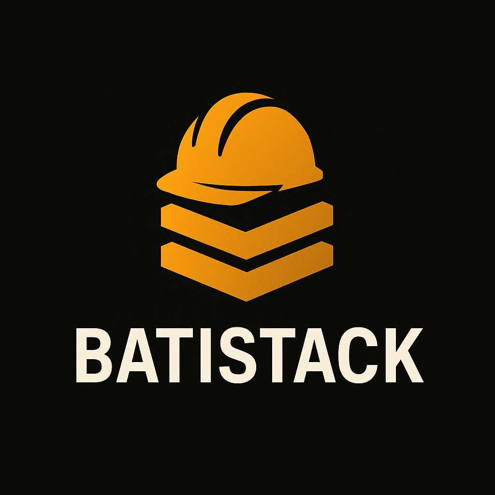
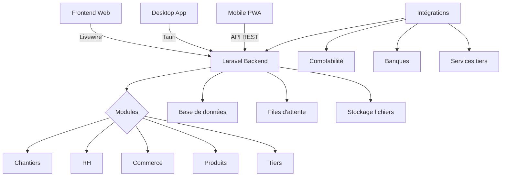

# 🏗️ Batistack - ERP Moderne pour le BTP



[](https://laravel.com)
[](https://php.net)
[](https://laravel-livewire.com)
[](https://filamentphp.com)
[](https://tauri.app)
[](LICENSE)
[](https://github.com/vortechstudio/batistack2/releases)

**Solution ERP tout-en-un** spécialement conçue pour les entreprises du BTP, avec modules intégrés pour une gestion complète de votre activité :

- 🏗️ **Chantiers** - Suivi temps réel, planning et rentabilité
- 👥 **Ressources Humaines** - Paie, contrats et gestion des équipes
- 📦 **Produits & Services** - Catalogue, stocks et logistique
- 💰 **Commerce** - Devis, factures et gestion financière
- 🏢 **Tiers** - Clients, fournisseurs et sous-traitants
- 📊 **Business Intelligence** - Tableaux de bord et analyses

## ✨ Fonctionnalités Principales

### 🏗️ Module Chantiers
- **Suivi en temps réel** des coûts et de l'avancement
- **Planning Gantt** intégré avec gestion des ressources
- **Gestion des sous-traitants** et interventions
- **Tableau de bord rentabilité** par chantier
- **Géolocalisation** et suivi terrain

### 👥 Module Ressources Humaines
- **Paie automatisée** avec profils personnalisables
- **Contrats électroniques** avec signature numérique
- **Gestion des pointages** et absences
- **Notes de frais** avec validation workflow
- **DPAE automatisé** et déclarations sociales
- **Portail salarié** dédié

### 📦 Module Produits & Services
- **Catalogue produits** avec spécifications techniques
- **Gestion des stocks** multi-entrepôts
- **Tarification dynamique** et grilles tarifaires
- **Traçabilité complète** des matériaux
- **Codes-barres/QR codes** pour inventaire

### 💰 Module Commerce
- **Workflow Devis → Commande → Facture** automatisé
- **Gestion multi-devises** et multi-TVA
- **Échéanciers** et suivi des paiements
- **Avoirs** et gestion des retours
- **Tableau de bord financier** temps réel

### 🏢 Module Tiers
- **Fiches clients/fournisseurs** complètes
- **Gestion des contacts** et historique
- **Évaluation fournisseurs** et performance
- **Intégration comptable** automatique

## 🛠️ Technologies

### Backend
- **Laravel 12.0** - Framework PHP moderne
- **PHP 8.2+** - Performances optimisées
- **SQLite/MySQL** - Base de données flexible
- **Laravel Horizon** - Gestion des files d'attente
- **Laravel Telescope** - Debugging et monitoring

### Frontend
- **Livewire 4.0** - Interactivité temps réel
- **Filament 4.0** - Interface d'administration
- **TailwindCSS 4.0** - Design system moderne
- **Alpine.js** - Interactions JavaScript légères
- **Mary UI** - Composants UI avancés

### Desktop & Mobile
- **Tauri 2.0** - Application desktop native
- **Rust** - Performance et sécurité
- **PWA Ready** - Application web progressive
- **API REST** - Intégrations tierces

### DevOps & Qualité
- **Pest** - Tests automatisés
- **Laravel Pint** - Code style
- **PHPStan** - Analyse statique
- **GitHub Actions** - CI/CD automatisé
- **Docker** - Containerisation

## 🚀 Installation

### Prérequis
- PHP 8.2 ou supérieur
- Composer 2.0+
- Node.js 18+ et npm
- SQLite ou MySQL

### Installation rapide
```bash
# Cloner le projet
git clone https://github.com/vortechstudio/batistack2.git
cd batistack

# Installation des dépendances
composer install
npm install

# Configuration
cp .env.example .env
php artisan key:generate

# Base de données
php artisan migrate --seed

# Assets frontend
npm run build

# Lancement
php artisan serve
```

### Installation avec Docker
```bash
# Lancement avec Docker Compose
docker-compose up -d

# Installation des dépendances
docker-compose exec app composer install
docker-compose exec app php artisan migrate --seed
```

### Application Desktop (Tauri)
```bash
# Développement
npm run dev:tauri:desktop

# Build production
npm run tauri build
```

## 📚 Documentation

### Guides utilisateur
- [🚀 Guide de démarrage](resources/docs/1.0/getting-started.md)
- [🏗️ Module Chantiers](resources/docs/1.0/chantiers.md)
- [👥 Module RH](resources/docs/1.0/hr.md)
- [📦 Module Produits](resources/docs/1.0/produits.md)
- [💰 Module Commerce](resources/docs/1.0/commerce.md)
- [🏢 Module Tiers](resources/docs/1.0/tiers.md)

### Documentation technique
- [📋 Changelog](CHANGELOG.md)
- [🗺️ Roadmap](ROADMAP.md)
- [⚙️ Configuration](resources/docs/1.0/settings.md)
- [🔌 API Documentation](resources/docs/1.0/api.md)

## 🛠️ Architecture



## 📊 Statistiques du Projet

- **+50 modèles** Eloquent pour une gestion complète
- **+200 tests** automatisés (Feature, Unit, Performance)
- **+100 migrations** pour une base de données robuste
- **+30 factories** pour les données de test
- **Architecture modulaire** pour une maintenance facilitée
- **Code coverage** > 80% sur les modules critiques

## 🔧 Commandes Utiles

```bash
# Développement
make dev                    # Lancement environnement complet
php artisan serve          # Serveur de développement
npm run dev                # Assets en mode watch

# Tests
php artisan test           # Tests complets
php artisan test --filter=RH  # Tests module spécifique
npm run test:performance   # Tests de performance

# Qualité code
./vendor/bin/pint          # Formatage code
./vendor/bin/phpstan       # Analyse statique
php artisan insights       # Métriques qualité

# Production
make install               # Installation production
php artisan optimize       # Optimisations Laravel
npm run build              # Build assets production
```

## 🤝 Contribution

Nous accueillons toutes les contributions ! Consultez nos guides :

- [📋 Guide de contribution](.github/CONTRIBUTING.md)
- [🔒 Code de conduite](.github/CODE_OF_CONDUCT.md)
- [🐛 Signaler un bug](https://github.com/vortechstudio/batistack2/issues)
- [💡 Proposer une fonctionnalité](https://github.com/vortechstudio/batistack2/discussions)

### Développement local
```bash
# Fork et clone
git clone https://github.com/votre-username/batistack2.git
cd batistack2

# Branche de développement
git checkout -b feature/ma-nouvelle-fonctionnalite

# Tests avant commit
php artisan test
./vendor/bin/pint
./vendor/bin/phpstan
```

## 📈 Roadmap

### Version 1.X.0 (Q1 2025)
- [ ] Module GPAO complet
- [ ] Intégration IoT chantiers
- [ ] API publique v2
- [ ] Application mobile native

### Version 2.0.0 (Q2 2025)
- [ ] Architecture microservices
- [ ] Intelligence artificielle
- [ ] Blockchain traçabilité
- [ ] Réalité augmentée

Voir la [roadmap complète](ROADMAP.md) pour plus de détails.

## 📄 Licence

Ce projet est sous licence MIT. Voir le fichier [LICENSE](LICENSE) pour plus de détails.

## 🏢 Support Commercial

Pour un support commercial, des formations ou des développements spécifiques :

- 📧 Email : contact@batistack.com
- 🌐 Site web : [www.batistack.com](https://www.batistack.com)
- 💬 Discord : [Communauté Batistack](https://discord.gg/batistack)

---

**Batistack** © 2024 - Développé avec ❤️ pour les professionnels du BTP

[](https://laravel.com)
[](https://laravel-livewire.com)
[](https://filamentphp.com)
