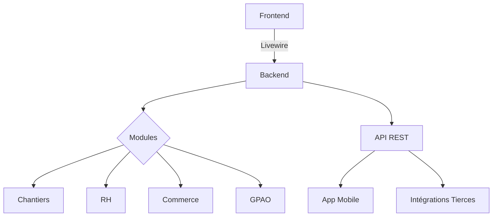
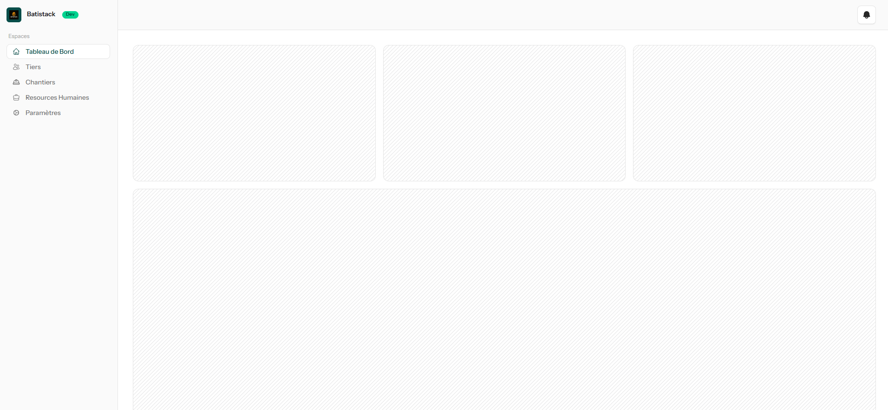
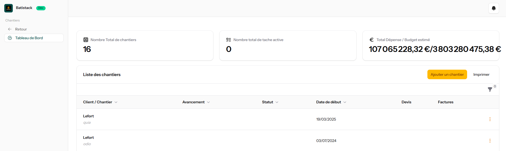

# 🏗️ Batistack - ERP Moderne pour le BTP


[](https://laravel.com)
[](https://laravel-livewire.com)
[](LICENSE)
[](https://github.com/batistack/batistack/releases)

**Solution tout-en-un** de gestion de projets de construction avec modules intégrés pour :
- 🏗️ Chantiers et planning
- 👥 Ressources humaines
- 📦 Stocks et logistique
- 💰 Facturation et comptabilité
- 📊 Business Intelligence

## ✨ Fonctionnalités

| Module | Description |
|--------|-------------|
| **Chantiers** | Suivi temps réel des coûts, planning Gantt, gestion des sous-traitants |
| **RH** | Paie automatisée, contrats électroniques, gestion des compétences |
| **Commerce** | Devis→Facture automatisé, gestion des fournisseurs, tableau de bord financier |
| **GPAO** | Ordonnancement de production, contrôle qualité IoT, traçabilité matière |
| **Mobile** | Application terrain avec synchronisation offline |

## 🚀 Démarrage rapide

```bash
# Cloner le dépôt
git clone https://github.com/batistack/batistack.git
cd batistack

# Lancer avec Docker (PHP 8.3 + MySQL + Redis)
docker-compose up -d

# Installer les dépendances
docker-compose exec app composer install

# Configurer l\'environnement
cp .env.master .env
```

## 📚 Documentation

Consultez notre documentation complète :
- [Guide d'installation](resources/docs/1.0/getting-started.md)
- [Changelog](CHANGELOG.md)
- [Roadmap](ROADMAP.md)

## 🛠️ Architecture



## 📸 Captures d'écran

| Tableau de bord | Fiche chantier |
|-----------------|----------------|
|  |  |

## 🤝 Contribution

Consultez notre [guide de contribution](.github/CONTRIBUTING.md) et les [bonnes pratiques](.github/CODE_OF_CONDUCT.md).

## 📄 License

MIT License - Voir le fichier [LICENSE](LICENSE)

---

**Batistack** © 2024 - [Documentation technique](resources/docs/1.0/)
